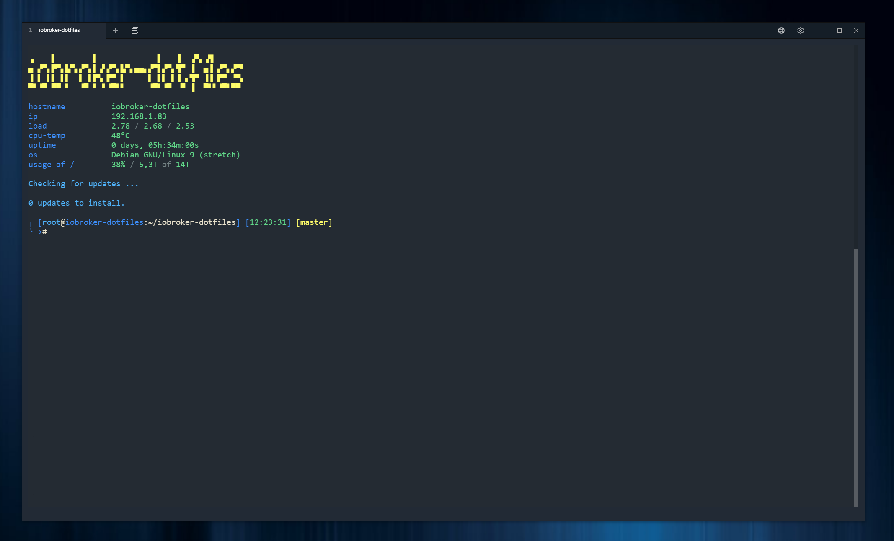

Not finished yet!

---

# ioBroker.dotfiles
dotfiles for Bash with some enhancements for ioBroker

Screenshot with Terminal https://github.com/Eugeny/terminus



## INSTALL
```
mkdir ~/iobroker-dotfiles
cd ~/iobroker-dotfiles
git clone https://github.com/darkiop/ioBroker.dotfiles.git .
./install-applications.sh
source ~/iobroker-dotfiles/bashrc
```
## DOCUMENTATION

### alias
...

### motd
...

### prompt
...
