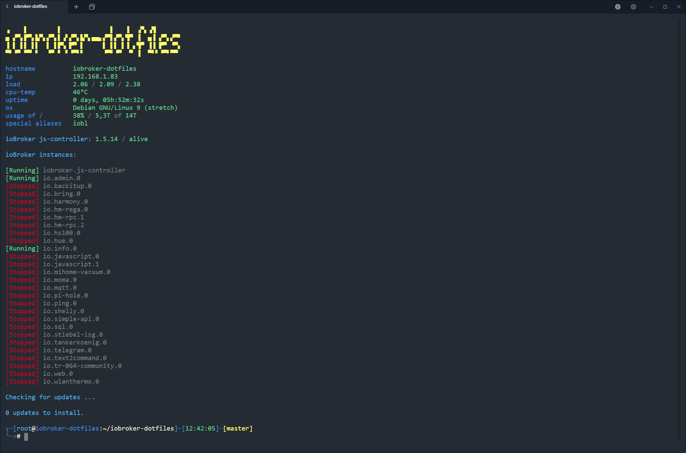

# ioBroker.dotfiles
dotfiles for Bash with some enhancements for ioBroker

Screenshot with Terminal https://github.com/Eugeny/terminus



## INSTALL
```
mkdir ~/dotfiles
cd ~/dotfiles
git clone https://github.com/darkiop/ioBroker.dotfiles.git .
./install-applications.sh
./install-bashrc.sh
source ~/.bashrc
```

```
mkdir ~/dotfiles && cd ~/dotfiles && git clone https://github.com/darkiop/ioBroker.dotfiles.git . && ./install-applications.sh && ./install-bashrc.sh && source ~/.bashrc
```
